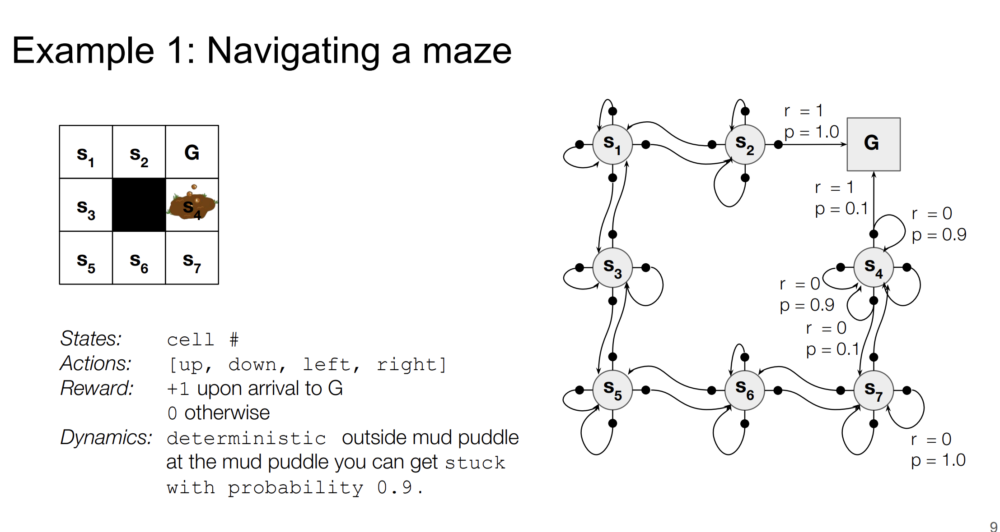
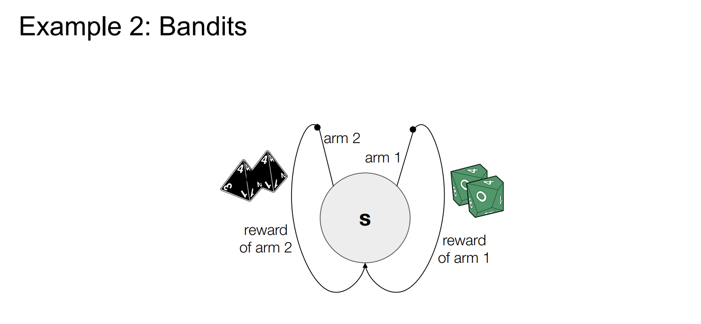

# Week 2

---

## Maze Navigating

| Component | Description |
|-----------|-------------|
| States | Cell number ($s_1, s_2, \ldots, s_7$, G) |
| Actions | [up, down, left, right] |
| Reward | +1 upon arrival to G, 0 otherwise |
| Dynamics | Deterministic outside mud puddle; at mud puddle, stuck with prob. 0.9 |

---

## Bandits

| Component | Description |
|-----------|-------------|
| State | **Only one state**, remains unchanged |
| Reward | Stochastic, depends on which arm is pulled |
| Action | Choose among available arms |
| Dynamics | **No dynamics** — always returns to same state |

---

## Boundary Between Agent and Environment

- The agent-environment boundary represents the limit of the agent's **absolute control**, but not its knowledge
  - e.g., **Robot control**: the agent sends motor commands (actions), but muscles, joints, and physical dynamics belong to the environment
  - e.g., **Chess**: the agent chooses moves, but the rules of the game and opponent's responses are part of the environment

---

## Formalizing the Agent-Env Interface

### Four-Argument Dynamics Function

$$p(s', r \mid s, a) = \Pr\{S_{t+1}=s',\, R_{t+1}=r \mid S_t=s,\, A_t=a\}$$

This defines a probability distribution over all $(s', r)$ pairs:

$$\sum_{s' \in \mathcal{S}} \sum_{r \in \mathcal{R}} p(s', r \mid s, a) = 1, \quad \forall s \in \mathcal{S}, a \in \mathcal{A}(s)$$

### Derived Quantities

| Quantity | Formula | Description |
|----------|---------|-------------|
| State Transition Prob. | $p(s' \mid s, a) = \sum_{r} p(s', r \mid s, a)$ | Prob. of next state given $(s, a)$ |
| Reward Probability | $p(r \mid s, a) = \sum_{s'} p(s', r \mid s, a)$ | Prob. of reward given $(s, a)$ |
| Expected Reward | $r(s, a) = \sum_{r} r \sum_{s'} p(s', r \mid s, a)$ | Expected immediate reward |

---

## Markov Property

> The future is independent of the past, **given** the present.

In an MDP, the Markov property is defined **given the current state and action**:

$$\Pr(S_{t+1}, R_{t+1} \mid S_t, A_t) = \Pr(S_{t+1}, R_{t+1} \mid S_1, A_1, S_2, A_2, \ldots, S_t, A_t)$$

Equivalently (if you only care about the next state):

$$\Pr(S_{t+1} \mid S_t, A_t) = \Pr(S_{t+1} \mid S_1, A_1, S_2, A_2, \ldots, S_t, A_t)$$

**Examples:**
- **Chess**: The full game state (board position, side to move, castling/en passant rights) is sufficient to determine legal moves and transitions
- **Pong**: The current frame plus velocities (or a short history of frames), together with the action, is sufficient to predict the next state

> This should be viewed as a restriction on the state representation. If the state is well defined, then it contains all the information necessary to predict the future, and the Markov property holds. If the state is not well defined, then it fails to summarize the relevant history, and the Markov property is violated.

---

## Reward Hypothesis

> That all of what we mean by goals and purposes can be well thought of as the maximization of the expected value of the cumulative sum of a received **scalar signal** (called reward).

---

## Returns

### The Ultimate Goal: Maximize Returns

$$G_t = R_{t+1} + R_{t+2} + \cdots + R_T$$

- Maximize the reward summation from timestamp $t$ to $T$ (end of an episode)

### Discounted Return

$$G_t = R_{t+1} + \gamma R_{t+2} + \gamma^2 R_{t+3} + \cdots = \sum_{k=0}^{\infty} \gamma^k R_{t+k+1}$$

where $0 \le \gamma \le 1$ is the **discount factor**.

**Why discount?**

| Reason | Explanation |
|--------|-------------|
| Mathematical | Ensures infinite sum converges (bounded by $\frac{R_{max}}{1-\gamma}$) |
| Intuitive | Immediate rewards are more certain than future rewards |
| Recursive | $G_t = R_{t+1} + \gamma G_{t+1}$ |

**Effect of $\gamma$:**
| Value | Behavior |
|-------|----------|
| $\gamma = 0$ | Myopic — only cares about immediate reward |
| $\gamma \to 1$ | Far-sighted — values future rewards almost equally |

---

## Episodic vs Continuing Tasks

| | Episodic Tasks | Continuing Tasks |
|---|----------------|------------------|
| **Terminal State** | Yes (episodes end) | No (runs forever) |
| **Return** | $G_t = \sum_{k=0}^{T-t-1} R_{t+k+1}$ | $G_t = \sum_{k=0}^{\infty} \gamma^k R_{t+k+1}$ |
| **Examples** | Chess, Maze navigation | Robot control, Stock trading |
| **Discount Factor** | Can use $\gamma = 1$ | Must use $\gamma < 1$ |
